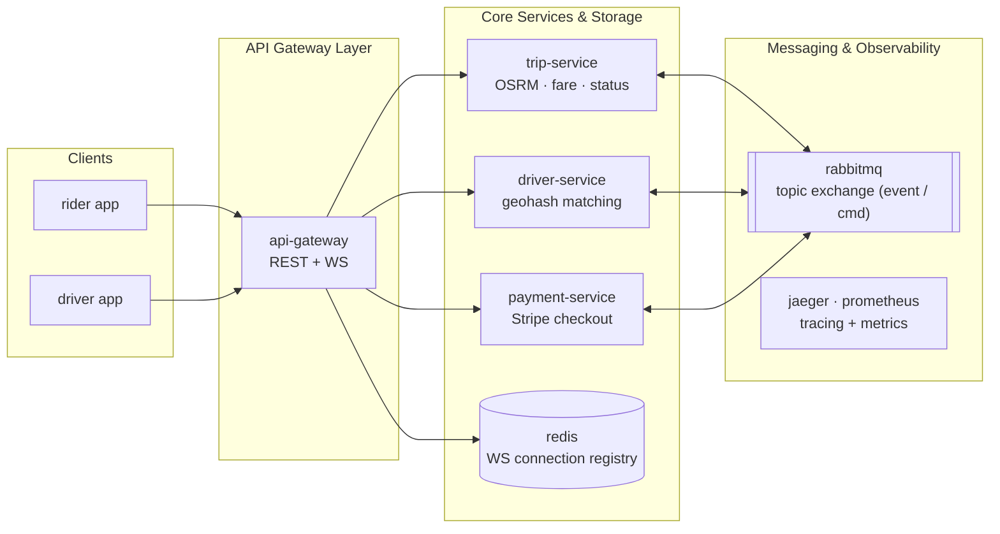
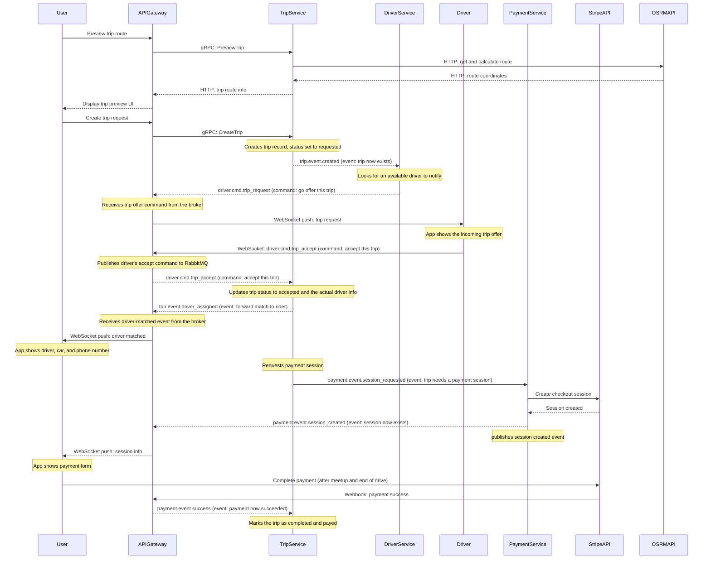

# Addis Ride

Addis Ride is an event-driven microservices ride-sharing platform designed for real-time driver matching, trip routing, and asynchronous payment settlement.

---

## System Architecture

The system uses an API Gateway handling REST and WebSocket client connections, gRPC for internal service communication, and RabbitMQ topic exchanges for event-driven asynchronous messaging.

---

## Trip & Payment Lifecycle Flow

The interaction flow below details route calculation via OSRM, driver matching via geohashes, and checkout completion using Stripe webhooks routed through the API Gateway.

